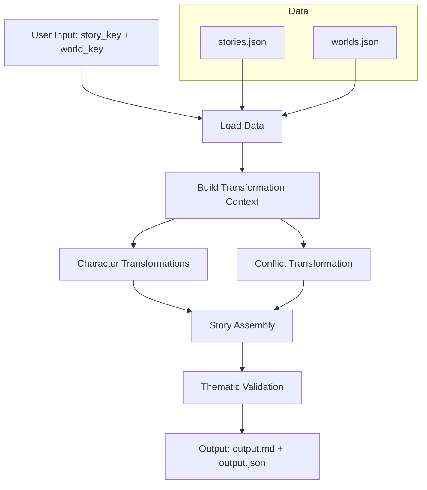
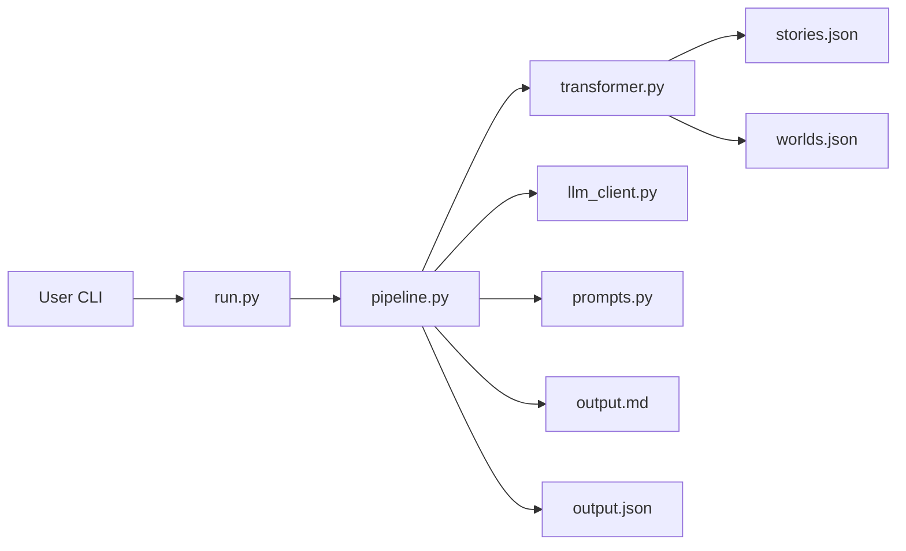
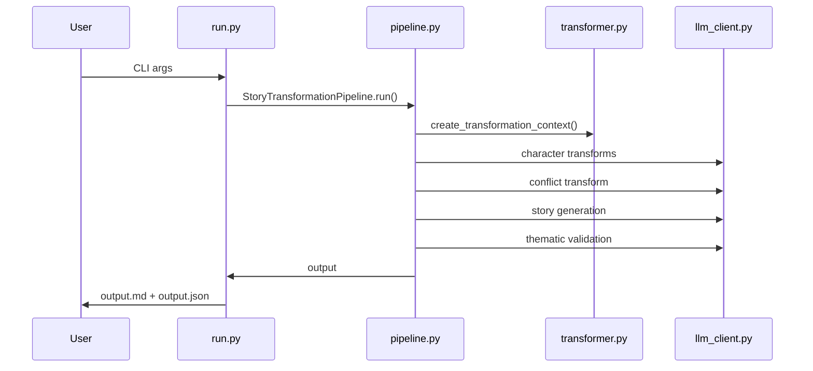

# Story Transformation System

A structured story adaptation system that reimagines public-domain narratives in new settings while preserving thematic and emotional fidelity. It combines a rule-based transformation layer with LLM-driven generation for controlled creativity.

---

## Quick Start (Windows)

```bash
# Install dependencies
pip install -r requirements.txt

# Set your Groq API key for this session (PowerShell)
$env:GROQ_API_KEY="your-groq-key-here"

# Run interactive mode
python run.py

# Or specify directly
python run.py --story romeo_and_juliet --world silicon_valley_tech
```

Get a free Groq API key at https://console.groq.com/keys

---

## What This Project Produces

**Primary output:** A reimagined story in a new world (800–1200 words) with brief transformation notes.

**Files created on each run:**
- output.md (story + concise intermediate notes)
- output.json (full pipeline output including transformations)

---

## System Architecture

### High-level Pipeline



### Detailed Component Diagram



### Sequence of Calls



---

## How It Works (Detailed)

### 1) Load Context
The system loads structured metadata for the source story and the target world:

- Source story: themes, key characters, plot beats, emotional core
- Target world: power structures, conflicts, values, taboos, aesthetics

### 2) Build Transformation Context
The transformer maps narrative **functions** (protagonist, antagonist, catalyst, helper) to equivalent roles in the new world. This preserves story logic while changing surface details.

### 3) Character Transformation
Each character is transformed via a structured prompt that enforces:
- same narrative role
- same traits expressed in new world
- same arc with world-appropriate circumstances

### 4) Conflict Transformation
The central conflict is re-expressed using the new world’s power dynamics while preserving the original emotional stakes.

### 5) Story Assembly
The LLM generates the full story using:
- transformed characters
- transformed conflict
- original plot beat structure
- world aesthetic

### 6) Validation
The story is checked for thematic fidelity and emotional alignment. This is used for internal evaluation (kept in output.json).

---

## Repository Structure

```
Task/
├── run.py              # CLI entry point and output formatting
├── pipeline.py         # Orchestration of the full pipeline
├── transformer.py      # Story/world mapping logic (no LLM calls)
├── prompts.py          # Prompt templates for each stage
├── llm_client.py       # Groq client wrapper
├── data/
│   ├── stories.json    # Source story metadata
│   └── worlds.json     # Target world metadata
└── docs/
    ├── SOLUTION.md     # System design notes
    └── STORY_OUTPUT.md # Example output
```

Key files (click to open):
- [run.py](run.py)
- [pipeline.py](pipeline.py)
- [transformer.py](transformer.py)
- [prompts.py](prompts.py)
- [llm_client.py](llm_client.py)
- [data/stories.json](data/stories.json)
- [data/worlds.json](data/worlds.json)
- [docs/SOLUTION.md](docs/SOLUTION.md)
- [docs/STORY_OUTPUT.md](docs/STORY_OUTPUT.md)

---

## Configuration

**Environment variables:**
- GROQ_API_KEY — required for LLM calls

PowerShell example:

```bash
$env:GROQ_API_KEY="your-groq-key-here"
```

---

## Command Line Usage

List options:

```bash
python run.py --list
```

Run with specific inputs:

```bash
python run.py --story hamlet --world cyberpunk_megacity
```

Change output filename base:

```bash
python run.py --story odyssey --world space_colony --output odyssey_space
```

---

## Output Format

### output.md
Contains:
1. Title + setting + themes
2. Full reimagined story
3. Short transformation notes (brief character mappings + conflict summary)

### output.json
Contains:
1. Metadata
2. Full character transformations
3. Full conflict transformation
4. Story
5. Validation report

---

## Data Schemas (Conceptual)

### Story Schema (data/stories.json)
- title
- author
- era
- core_themes[]
- central_conflict
- key_characters[] (name, role, traits[], arc)
- plot_beats[]
- emotional_core

### World Schema (data/worlds.json)
- name
- era
- setting
- power_structures[]
- conflicts[]
- communication[]
- social_hierarchy[]
- values[]
- taboos[]
- technology_level
- aesthetic

---

## Prompting Strategy

The system avoids a single giant prompt. Instead it uses a chain of smaller prompts:

1. Character transformation prompts (low temperature)
2. Conflict transformation prompt (low temperature)
3. Story assembly prompt (higher temperature)
4. Validation prompt (low temperature)

This improves consistency, debuggability, and control over outputs.

---

## Extending the System

### Add a New Story
Edit [data/stories.json](data/stories.json) and add:
- core themes
- character list with roles + arcs
- plot beats + emotional core

### Add a New World
Edit [data/worlds.json](data/worlds.json) and add:
- power structures
- conflicts and values
- aesthetics and communication methods

---

## Troubleshooting

**Missing GROQ_API_KEY**
- Ensure the environment variable is set in the same terminal session.

**Module not found (groq)**
- Reinstall dependencies: pip install -r requirements.txt

**Empty or weak story output**
- Try a different story/world pair.
- Increase temperature in [llm_client.py](llm_client.py) if needed.

---

## Design Philosophy

**Preserve function, change form.** Narrative roles and emotional stakes are preserved, while the setting, aesthetics, and surface-level details are transformed to fit the new world.

For design notes and rationale, see [docs/SOLUTION.md](docs/SOLUTION.md).
