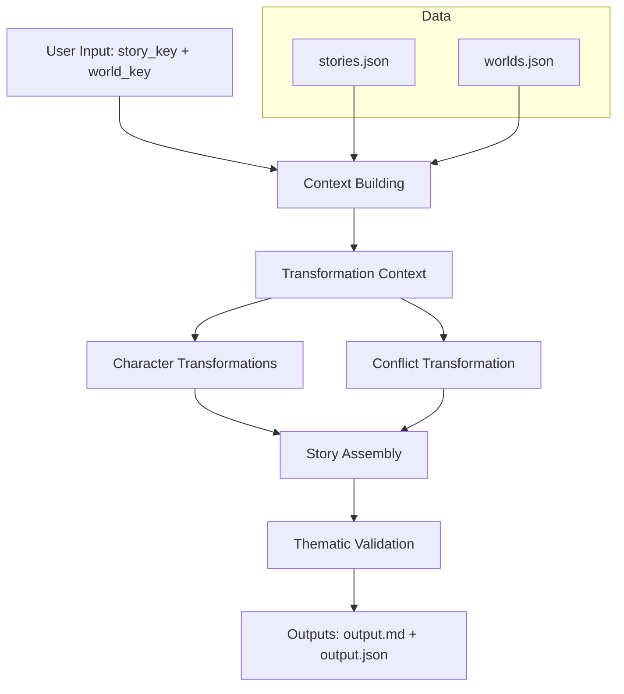
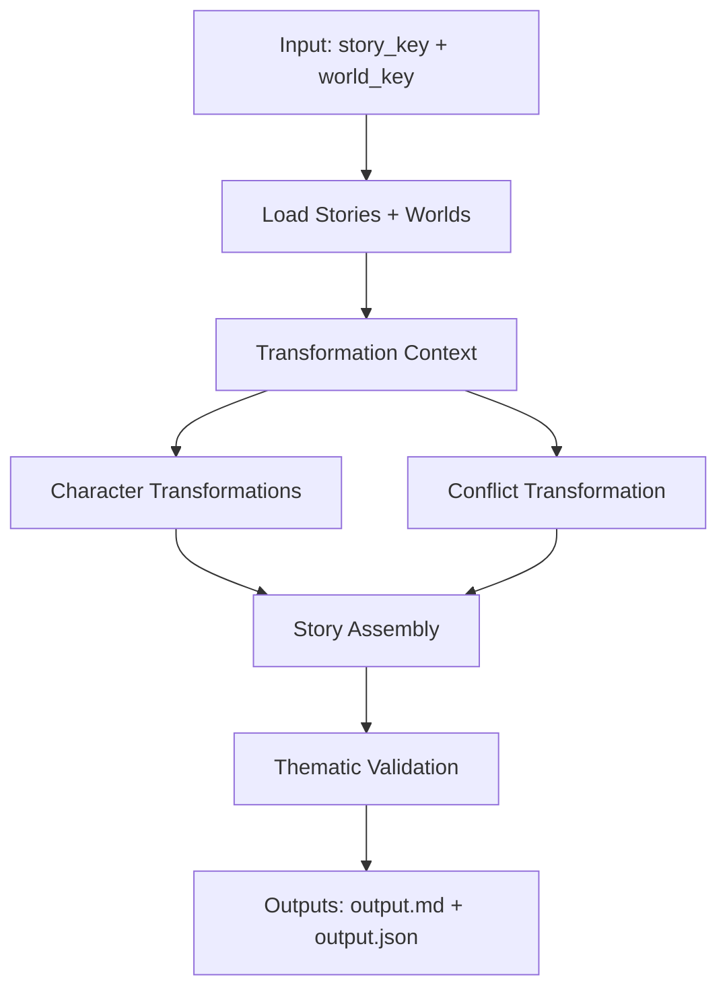
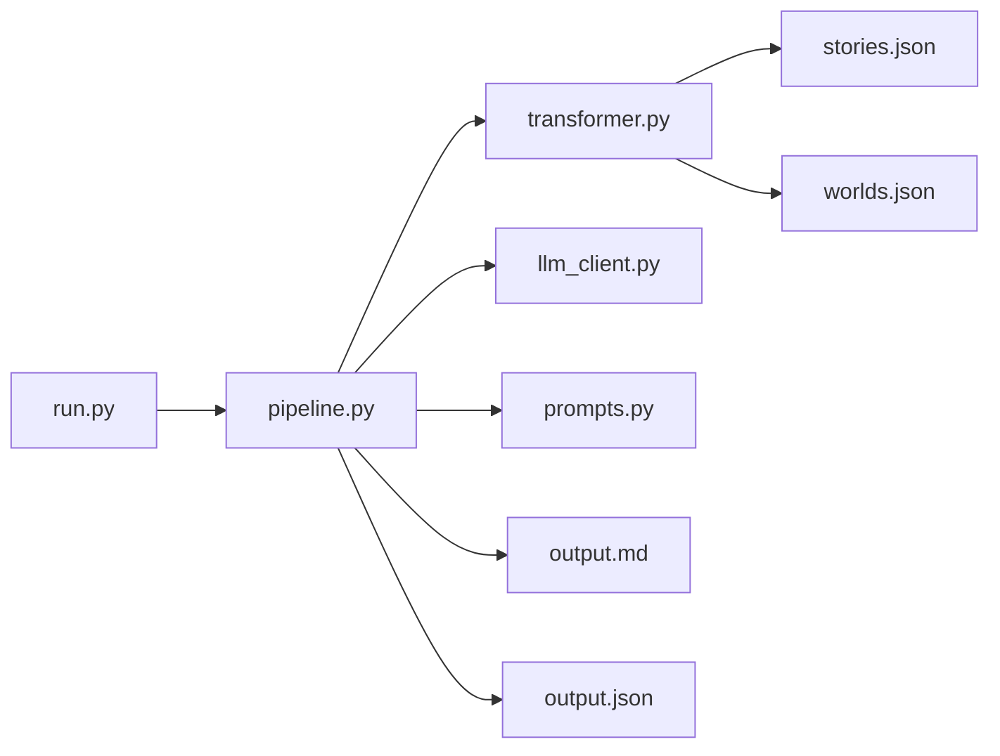

Story Transformation System - Solution Documentation

Overview

This system transforms classic public-domain narratives into alternate settings while preserving their thematic and emotional core.

The key insight driving the design: good adaptations preserve FUNCTION while changing FORM.

---

## Transformer/Model Used

LLM Provider: Groq (API)

Model: Llama 3.1 8B (instant)

Why this model:
- Fast inference for chained prompts
- Stable at low temperature for structured outputs

Implementation: The model call lives in [llm_client.py](llm_client.py) and is used by [pipeline.py](pipeline.py).

---

## Approach Diagram



---

## Architecture Diagrams (Mermaid)

## End-to-End Pipeline



## Module Architecture



---

## Solution Design (Only What Is Implemented)

## Core Principle: Structured Creativity

The system constrains creativity with structure and lets the model fill in detail within those bounds.

## Architecture Layers

Data Layer (`data/`)
- Story/world metadata used by the transformer

Transformation Layer ([transformer.py](transformer.py))
- Maps roles, conflicts, and plot beats into the target world

Prompt Layer ([prompts.py](prompts.py))
- Templates for character, conflict, story, and validation generation

LLM Layer ([llm_client.py](llm_client.py))
- Groq client + model settings

Pipeline Layer ([pipeline.py](pipeline.py))
- Orchestrates each stage and aggregates outputs

## Key Design Decisions

1. Role preservation keeps characters functionally consistent across worlds.
2. Conflict abstraction maps core stakes into new power dynamics.
3. Plot-beat skeleton preserves narrative arc while changing surface events.

---

## File Structure

```
Task/
├── run.py              # Main entry point
├── pipeline.py         # Orchestration logic
├── transformer.py      # Transformation rules
├── prompts.py          # LLM prompt templates
├── llm_client.py       # API wrapper
├── data/
│   ├── stories.json    # Source story metadata
│   └── worlds.json     # Target world metadata
├── docs/
│   ├── SOLUTION.md     # This document
│   └── STORY_OUTPUT.md # Sample generated story
└── requirements.txt    # Dependencies
```

---

## Alternatives Considered

## 1. Fully Prompt-Based vs. Structured Pipeline

Alternative Evaluated: Single mega-prompt approach
- "Transform Romeo & Juliet into Silicon Valley in one pass"

Why Rejected:
- Low consistency across runs
- Difficult to debug which part failed
- No intermediate validation checkpoints
- Temperature tuning affects entire output uniformly

Chosen Approach: Multi-stage pipeline with specialized prompts
- Character transformation (low temp) → Conflict mapping (low temp) → Story generation (high temp) → Validation (low temp)
- Each stage optimized for its specific task
- Intermediate outputs can be reviewed and refined

## 2. Few-Shot Prompting Approaches

Alternative Evaluated: Include 2-3 complete transformation examples in each prompt

Pros: Could improve consistency and quality
Cons: Token limit constraints, examples become outdated, reduces flexibility

Chosen Approach: Zero-shot with structured templates
- More flexible across different story/world combinations
- Cleaner prompts focused on task specification
- Data-driven constraints from `stories.json` and `worlds.json`

## 3. End-to-End LLM vs. Hybrid Architecture

Alternative Evaluated: Pure LLM approach for all mappings

Why Rejected:
- Character role mappings can be done deterministically
- LLM not needed for simple JSON → JSON transformations
- Cost and latency without clear benefit

Chosen Approach: Hybrid system
- Pure Python logic for story/world mapping ([transformer.py](transformer.py))
- LLM only for creative generation tasks

---

## Challenges & Mitigations

## 1. Challenge: Coherence Across Pipeline Stages

Problem:Each LLM call is independent, risk of character inconsistency between stages

Mitigation Implemented:

- Structured character mappings persist through pipeline state
- Assembly prompt receives full character descriptions from earlier stages  
- Validation step checks for thematic drift

Evidence: Characters maintain consistent traits from transformation → final story

## 2. Challenge: Consistency Across Multiple Runs

Problem: LLM temperature needed for creativity vs. consistency

Solution Implemented:
- Low temperature (0.4) for character/conflict mapping
- Higher temperature (0.85) only for final story generation
- Structured prompts constrain creative freedom within bounds
- Retry mechanism in [llm_client.py](llm_client.py) for API failures

Result: Core mappings are stable, only prose style varies

## 3. Challenge: Reproducibility

Problem: Non-deterministic LLM outputs make testing difficult

Mitigation Strategy:
- Fixed data schemas in JSON files
- Extensive logging in pipeline for debugging
- Validation step provides quality scores
- Output saved to both JSON (structured) and Markdown (readable)

## 4. Challenge: Domain Knowledge Integration

Problem:System needs to understand both source stories and target worlds deeply
Solution Implemented:
- Curated metadata in `stories.json` and `worlds.json`
- Character role taxonomy (protagonist, antagonist, catalyst, helper, victim, mentor)
- World attribute categorization (power_structures, conflicts, values, taboos)
- Mapping logic preserves narrative function while changing form

---

## Future Improvements

## Product Scaling

1. API Service Architecture
- RESTful API endpoints: `/transform`, `/validate`, `/characters`
- Asynchronous processing for longer stories  
- User account system for custom story/world additions

2. Enhanced Data Layer
- Database replacement for JSON files
- User-contributed story/world repository
- Version control for story metadata
- Similarity search for story recommendations

3. Quality Improvements
- Human feedback integration for fine-tuning
- Multiple output variants per request
- Style transfer options (literary vs. modern prose)
- Length control (short story, novella, novel chapter)

## Technical Enhancements

1. Advanced Prompting
- Chain-of-thought for complex character arcs
- Constitutional AI for consistent thematic preservation
- Multi-agent validation (separate agents for plot, character, theme consistency)

2. Model Integration
- Support for multiple LLM providers (OpenAI, Anthropic, local models)
- Model routing based on task type
- Fine-tuned models for specific transformation patterns

3. Output Formats
- Screenplay format
- Interactive fiction
- Multimedia story with images
- Audio narration integration

## Business Model Potential

1. Educational Applications
- Literature teaching tool
- Creative writing assistance
- Cross-cultural story exploration

2. Entertainment Industry
- TV/film adaptation pipeline
- Game narrative generation
- Marketing content creation

3. Research Applications
- Comparative literature analysis
- Cultural adaptation studies
- Narrative structure research
