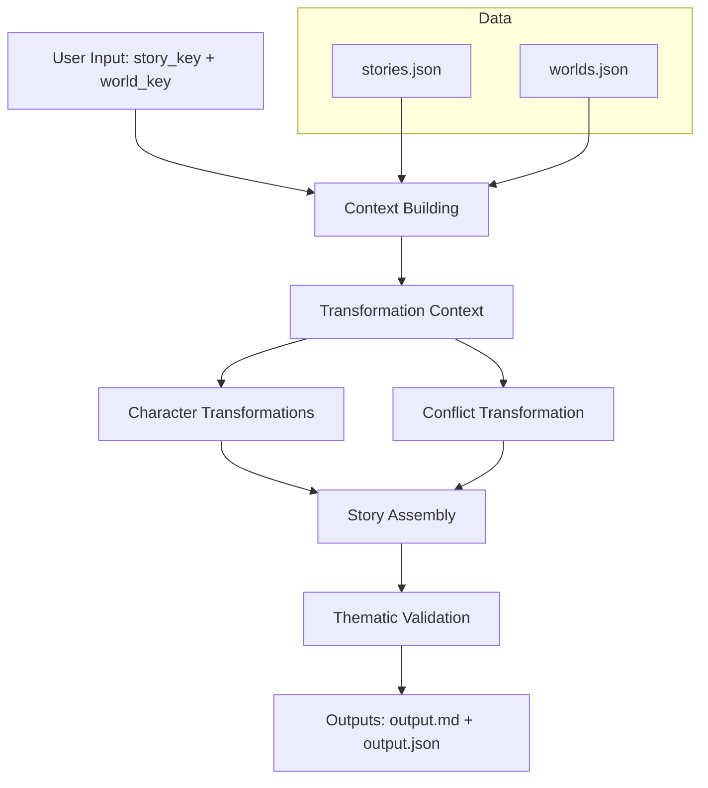
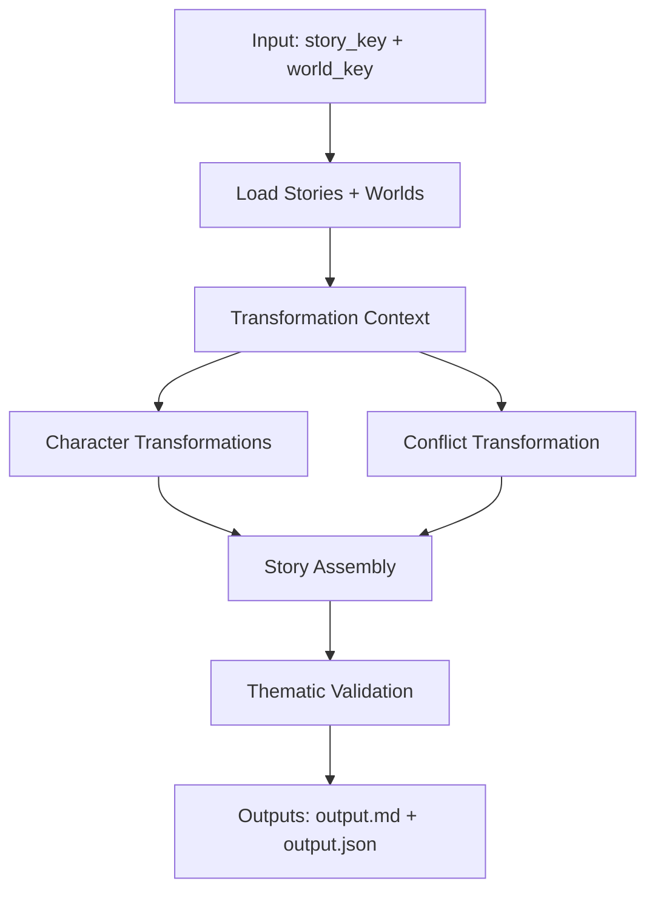
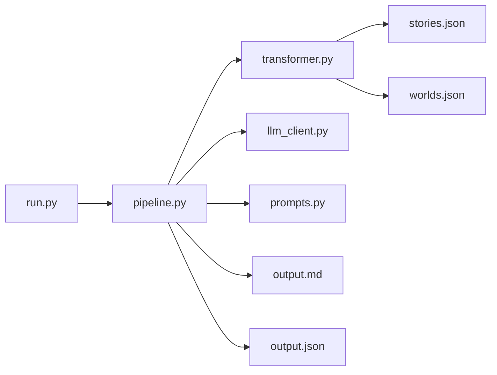

Story Transformation System - Solution Documentation

Overview

This system transforms classic public-domain narratives into alternate settings while preserving their thematic and emotional core.

The key insight driving the design: good adaptations preserve FUNCTION while changing FORM.

---

## Transformer/Model Used

**LLM Provider:** Groq (API)

**Model:** Llama 3.1 8B (instant)

**Why this model:**
- Fast inference for chained prompts
- Stable at low temperature for structured outputs

**Implementation:** The model call lives in [llm_client.py](llm_client.py) and is used by [pipeline.py](pipeline.py).

---

## Approach Diagram



---

## Architecture Diagrams (Mermaid)

### End-to-End Pipeline



### Module Architecture



---

## Solution Design (Only What Is Implemented)

### Core Principle: Structured Creativity

The system constrains creativity with structure and lets the model fill in detail within those bounds.

### Architecture Layers

Data Layer (`data/`)
- Story/world metadata used by the transformer

Transformation Layer ([transformer.py](transformer.py))
- Maps roles, conflicts, and plot beats into the target world

Prompt Layer ([prompts.py](prompts.py))
- Templates for character, conflict, story, and validation generation

LLM Layer ([llm_client.py](llm_client.py))
- Groq client + model settings

Pipeline Layer ([pipeline.py](pipeline.py))
- Orchestrates each stage and aggregates outputs

### Key Design Decisions

1. **Role preservation** keeps characters functionally consistent across worlds.
2. **Conflict abstraction** maps core stakes into new power dynamics.
3. **Plot-beat skeleton** preserves narrative arc while changing surface events.

---

## File Structure

```
Task/
├── run.py              # Main entry point
├── pipeline.py         # Orchestration logic
├── transformer.py      # Transformation rules
├── prompts.py          # LLM prompt templates
├── llm_client.py       # API wrapper
├── data/
│   ├── stories.json    # Source story metadata
│   └── worlds.json     # Target world metadata
├── docs/
│   ├── SOLUTION.md     # This document
│   └── STORY_OUTPUT.md # Sample generated story
└── requirements.txt    # Dependencies
```
